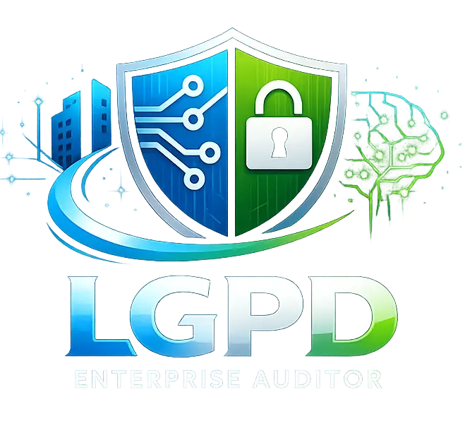
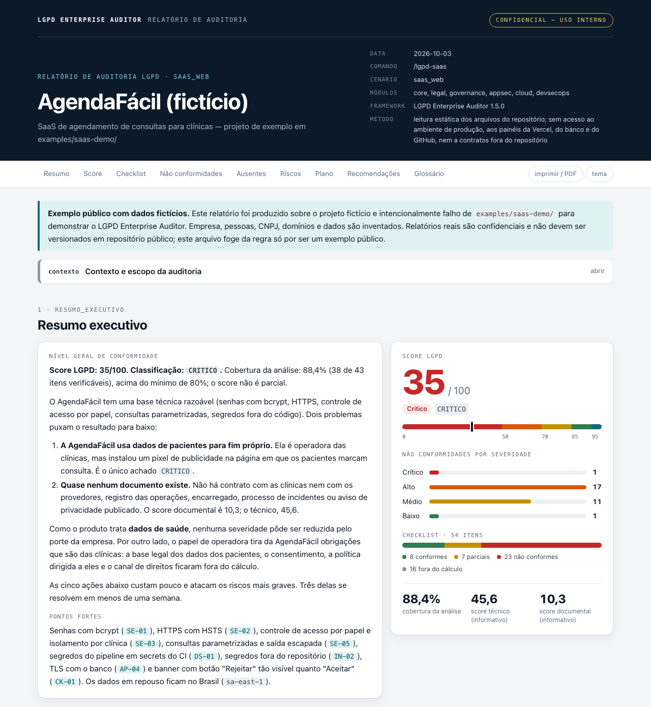

# LGPD Enterprise Auditor

<p align="center">
  
</p>

<p align="center">
  <a href="https://github.com/BrunoLagoa/lgpd-enterprise-auditor/stargazers"></a>
  <a href="https://github.com/BrunoLagoa/lgpd-enterprise-auditor/releases/latest"></a>
  <a href="https://github.com/BrunoLagoa/lgpd-enterprise-auditor/actions/workflows/install.yml"></a>
  <a href="./LICENSE"></a>
  <a href="https://github.com/BrunoLagoa/lgpd-enterprise-auditor"></a>
</p>

<!-- README-I18N:START -->

**Português (Brasil)** | [English](./README.en.md)

<!-- README-I18N:END -->

Framework de auditoria LGPD orientado a evidências, com foco em segurança, governança e uso de IA em engenharia de software.

Este projeto foi desenhado para funcionar como um sistema auditável e modular, pronto para ser reutilizado em diferentes produtos e times.

**Em resumo:** você instala o auditor no seu projeto com um comando, roda `/lgpd-saas` (ou outro cenário) no seu assistente de IA e recebe um relatório com score de 0 a 100, não conformidades com o artigo da LGPD e a evidência de cada uma, e um plano de adequação com prazos e esforço. Funciona com Claude Code, Cursor, VS Code + GitHub Copilot, OpenCode, Codex e Gemini CLI.

Você escolhe o formato do relatório no início da auditoria: `.md` (texto completo, bom para versionar e comparar), `.html` (para ler no navegador, com o score em destaque, filtros, busca e versão para impressão) ou os dois. O `.html` é um arquivo único, funciona offline e não carrega nada de fora.

Veja um relatório de exemplo, gerado sobre um SaaS fictício, nos dois formatos:

- [Relatório em Markdown (`.md`)](./examples/saas-demo/relatorio-auditoria-lgpd.md): abre aqui mesmo, no GitHub.
- [Relatório em HTML (`.html`)](./examples/saas-demo/relatorio-auditoria-lgpd.html): baixe o arquivo e abra no navegador. A imagem abaixo mostra o topo dele.

[](./examples/saas-demo/relatorio-auditoria-lgpd.html)

## O que é este projeto

O `lgpd-enterprise-auditor` é um framework que combina:

- auditoria jurídica (LGPD + ANPD);
- auditoria técnica (appsec, cloud, mobile, devsecops, IA/LLM);
- modelo de severidade e score;
- formato de relatório padronizado;
- comandos práticos para execução por cenário.

Na prática, ele permite rodar auditorias completas ou direcionadas com consistência de critérios, evidências e plano de adequação.

## Instalação

Um único comando interativo, executado na raiz do projeto que você quer auditar. Ele pergunta qual ferramenta de IA você usa e se quer instalar também a skill, mostra um resumo e instala tudo **localmente, dentro desse projeto** (não existe instalação global).

**macOS / Linux / WSL / Git Bash**

```bash
curl -fsSL https://github.com/BrunoLagoa/lgpd-enterprise-auditor/releases/latest/download/install.sh | bash -s -- install
```

**Windows (PowerShell)**

```powershell
powershell -ExecutionPolicy Bypass -Command "iwr https://github.com/BrunoLagoa/lgpd-enterprise-auditor/releases/latest/download/install.ps1 -OutFile $env:TEMP\lgpd-install.ps1; & $env:TEMP\lgpd-install.ps1 install"
```

Prefere ler o script antes de rodar? Baixe (`curl -fsSL <url> -o install.sh`), revise e depois execute `bash install.sh install`.

Os comandos acima baixam o instalador da última release, a mesma versão do framework que ele instala. O instalador usa a última versão publicada. Se não conseguir consultá-la (sem rede ou limite da API do GitHub), ele avisa e não instala a branch `main` por conta própria: no modo interativo pergunta antes; com `--non-interactive`, para e pede `--version`.

**Conferir a integridade.** As releases a partir da v1.6.0 publicam `install.sh`, `install.ps1` e `SHA256SUMS`. Para instalar uma versão exata e conferir o arquivo antes de rodar:

```bash
V=vX.Y.Z   # a versão desejada
curl -fsSLO "https://github.com/BrunoLagoa/lgpd-enterprise-auditor/releases/download/${V}/install.sh"
curl -fsSLO "https://github.com/BrunoLagoa/lgpd-enterprise-auditor/releases/download/${V}/SHA256SUMS"
shasum -a 256 --ignore-missing -c SHA256SUMS   # no Linux: sha256sum --ignore-missing -c SHA256SUMS
bash install.sh install --version "$V"
```

### Onde os arquivos ficam

O framework (`.agents/lgpd-enterprise-auditor/`) é o mesmo para todas as ferramentas; só os comandos e a skill opcional mudam de lugar:

| Ferramenta (`--target`) | Comandos | Skill (opcional) |
|---|---|---|
| `claude` — Claude Code | `.claude/commands/lgpd-*.md` | `.claude/skills/lgpd-enterprise-auditor/` |
| `cursor` — Cursor | `.cursor/commands/lgpd-*.md` | `.agents/skills/lgpd-enterprise-auditor/` |
| `vscode` — VS Code + GitHub Copilot | `.github/prompts/lgpd-*.prompt.md` | `.agents/skills/lgpd-enterprise-auditor/` |
| `opencode` — OpenCode | `.opencode/commands/lgpd-*.md` | `.agents/skills/lgpd-enterprise-auditor/` |
| `agents` — Codex, Gemini CLI e similares | — (sem slash commands) | `.agents/skills/lgpd-enterprise-auditor/` (sempre instalada) |

- **Sem a skill (padrão):** a auditoria é acionada pelos slash commands (`/lgpd-saas`, `/lgpd-full-audit`…), que executam o framework modular (`.agents/lgpd-enterprise-auditor/`).
- **Com a skill:** o assistente também pode iniciar a auditoria a partir de um pedido em linguagem natural ("faça uma auditoria LGPD deste projeto"), carregando a skill autocontida (`SKILL.md`).
- Várias ferramentas no mesmo projeto são suportadas: rode o instalador uma vez por ferramenta. Elas compartilham a pasta do framework.

### Atualizar, verificar e desinstalar

| Ação | Comando (bash) | PowerShell |
|---|---|---|
| Atualizar todas as ferramentas instaladas | `… \| bash -s -- update` | `… install.ps1 update` |
| Verificar a instalação | `… \| bash -s -- check` | `… install.ps1 check` |
| Desinstalar | `… \| bash -s -- uninstall` | `… install.ps1 uninstall` |

`…` representa o mesmo prefixo `curl …/install.sh` ou `iwr …/install.ps1` usado na instalação.

Uso em scripts / CI (sem perguntas):

```bash
curl -fsSL https://github.com/BrunoLagoa/lgpd-enterprise-auditor/releases/latest/download/install.sh \
  | bash -s -- install --non-interactive --target cursor --with-skill
```

| Opção (bash) | PowerShell | Descrição |
|---|---|---|
| `--target <ferramenta>` | `-Target` | `claude`, `cursor`, `vscode`, `opencode` ou `agents` (obrigatória com `--non-interactive`) |
| `--with-skill` / `--no-skill` | `-WithSkill` / `-NoSkill` | Instala ou não a skill (padrão: não) |
| `--project-dir <dir>` | `-ProjectDir` | Projeto de destino (padrão: raiz git do diretório atual) |
| `--version <ref>` | `-Version` | Tag ou branch (padrão: última tag publicada) |
| `--non-interactive` | `-NonInteractive` | Executa sem perguntas |

Cada instalação registra um manifesto em `.agents/lgpd-enterprise-auditor/.install/<ferramenta>.json`; `update`, `check` e `uninstall` se baseiam nele e nunca mexem em arquivos que não sejam do framework.

Se você aceitar o backup oferecido na reinstalação, a cópia vai para `.lgpd-auditor-backup/` no seu projeto — adicione essa pasta ao `.gitignore`:

```gitignore
.lgpd-auditor-backup/
```

As notas de cada versão estão no [CHANGELOG](./CHANGELOG.md).

### Instalação manual

Copie `.agents/lgpd-enterprise-auditor/` para a raiz do seu projeto e os arquivos de `commands/` para a pasta de comandos da sua ferramenta (tabela acima). Para a skill, copie `SKILL.md` para `<pasta de skills>/lgpd-enterprise-auditor/SKILL.md`.

## Base legal e atualização

Este framework usa como referência principal a **Lei Geral de Proteção de Dados (LGPD)**:

- **Texto oficial (Planalto):** [Lei nº 13.709/2018](https://www.planalto.gov.br/ccivil_03/_ato2015-2018/2018/lei/l13709.htm)
- **Órgão regulador:** [ANPD](https://www.gov.br/anpd/) — desde a **Lei nº 15.352/2026**, denominada **Agência** Nacional de Proteção de Dados e submetida ao regime das agências reguladoras da Lei nº 13.848/2019 (art. 55-A da LGPD).
- **Norma correlata:** [ECA Digital — Lei nº 15.211/2025](https://www.gov.br/anpd/pt-br/assuntos/eca-digital), em vigor desde 17/03/2026, regulamentada pelo Decreto nº 12.880/2026 e fiscalizada pela ANPD.
- **Plataformas digitais:** [Decreto nº 12.975/2026](https://www.planalto.gov.br/ccivil_03/_ato2023-2026/2026/decreto/D12975.htm) (atualiza a regulamentação do Marco Civil da Internet — dever de cuidado, notificação e remoção, anúncios, guarda de registros de acesso) e [Decreto nº 12.976/2026](https://www.planalto.gov.br/ccivil_03/_ato2023-2026/2026/decreto/D12976.htm) (proteção de mulheres na internet), em vigor desde 20/07/2026 e fiscalizados pela ANPD.

Regulamentos da ANPD considerados pelo framework:

| Resolução | Assunto |
|---|---|
| CD/ANPD nº 1/2021 | Processo de fiscalização e processo administrativo sancionador |
| CD/ANPD nº 2/2022 | Agentes de tratamento de pequeno porte |
| CD/ANPD nº 4/2023 | Dosimetria e aplicação de sanções |
| CD/ANPD nº 15/2024 | Comunicação de incidente de segurança (3 dias úteis) |
| CD/ANPD nº 18/2024 | Atuação do encarregado (DPO) |
| CD/ANPD nº 19/2024 | Transferência internacional e cláusulas-padrão contratuais |
| CD/ANPD nº 30/2025 | Mapa de Temas Prioritários de fiscalização 2026-2027 |
| CD/ANPD nº 31/2025 | Agenda Regulatória 2025-2026 |
| CD/ANPD nº 32/2026 | União Europeia reconhecida como grau adequado de proteção |

| Item | Valor |
|------|--------|
| Última sincronização | `2026-10` |

## Como o projeto está organizado

```text
.
├── SKILL.md
├── scripts/
│   ├── install.sh
│   ├── install.ps1
│   ├── validate-report.py
│   └── tests/
├── commands/
│   ├── lgpd-full-audit.md
│   ├── lgpd-saas.md
│   ├── lgpd-web.md
│   ├── lgpd-mobile.md
│   ├── lgpd-ai-llm.md
│   ├── lgpd-devsecops.md
│   ├── lgpd-eca-digital.md
│   └── lgpd-plataformas-digitais.md
└── .agents/
    └── lgpd-enterprise-auditor/
        ├── core/
        ├── legal/
        ├── governance/
        ├── cloud/
        ├── appsec/
        ├── mobile/
        ├── devsecops/
        ├── ai-llm/
        ├── orchestrator/
        ├── templates/
        ├── reports/
        └── validation/
```

### Fonte canônica

O caminho base canônico do framework modular é:

`.agents/lgpd-enterprise-auditor/`

Esse é o padrão esperado para projetos que adotarem a mesma estrutura.

## Como funciona

O fluxo da auditoria segue 5 passos:

1. **Contexto do projeto**: stack, dados tratados, integrações e operação.
2. **Roteamento inteligente**: o orquestrador ativa módulos por cenário.
3. **Checklist com evidência**: todos os itens do catálogo dos módulos ativos são avaliados, cada um com ID fixo e peso definido; nada é marcado como conforme sem comprovação.
4. **Consolidação**: severidade, score e classificação final. Com achado crítico aberto, a classificação não passa de `PARCIALMENTE_CONFORME`; em cenário direcionado, o relatório sai com a marca **escopo direcionado** e a lista dos domínios não auditados.
5. **Saída padronizada**: relatório executivo/técnico/compliance + plano de adequação, gravado em `.md`, em `.html` ou nos dois.

O relatório, em qualquer formato, descreve falhas que podem estar abertas e é **confidencial**: guarde-o fora de repositórios públicos (por exemplo, numa pasta listada no `.gitignore`).

Para conferir um relatório gerado (IDs do catálogo, valores permitidos, relação entre itens e achados e o cálculo do score), rode `python3 scripts/validate-report.py <relatorio.html>` a partir de um clone deste repositório.

## Comandos disponíveis

Depois da instalação, cada arquivo de `commands/` vira um slash command no seu assistente. São 8: um faz a auditoria completa e sete fazem auditorias direcionadas por tipo de sistema. Com o destino `agents` (Codex, Gemini CLI e similares) não há slash commands: peça a auditoria em linguagem natural, pela skill.

| Comando | Cenário | Quando usar | Módulos ativados (além de `core` e `legal`) |
|---|---|---|---|
| `/lgpd-full-audit` | `full_audit` | Auditoria completa, com os 17 domínios | `eca-digital`, `plataformas-digitais`, `governance`, `cloud`, `appsec`, `mobile`, `devsecops`, `ai-llm` |
| `/lgpd-saas` | `saas_web` | SaaS web | `governance`, `appsec`, `cloud`, `devsecops` |
| `/lgpd-web` | `web_site` | Sites institucionais, landing pages, blogs e portais | `governance`, `appsec`, `cloud` |
| `/lgpd-mobile` | `mobile_app` | Aplicativos mobile (iOS, Android, Flutter, React Native) | `governance`, `mobile`, `appsec`, `cloud` |
| `/lgpd-ai-llm` | `ai_llm_system` | Sistemas que usam IA/LLM | `governance`, `ai-llm`, `appsec` |
| `/lgpd-devsecops` | `devsecops_pipeline` | Pipelines de CI/CD e supply chain | `devsecops`, `cloud`, `appsec` |
| `/lgpd-eca-digital` | `eca_digital_platform` | Plataformas acessadas por crianças e adolescentes (LGPD art. 14 + ECA Digital, Lei nº 15.211/2025) | `eca-digital`, `governance`, `appsec`, `mobile` |
| `/lgpd-plataformas-digitais` | `digital_platform` | Provedores de aplicações com conteúdo de terceiros, anúncios pagos ou IA que gera imagem/voz (Decretos nº 12.975/2026 e nº 12.976/2026) | `plataformas-digitais`, `governance`, `appsec`, `cloud` |

`core` e `legal` são ativados em todos os cenários. Só o `/lgpd-full-audit` cobre tudo; o relatório dos outros sete sai com a marca **escopo direcionado** e lista os domínios que não foram auditados.

### O que cada comando verifica

- **`/lgpd-full-audit`**: levanta a stack completa (frontend, backend, banco, cloud), os dados pessoais e sensíveis tratados, as integrações de terceiros, o contexto de DevSecOps e de IA/LLM, a presença de menores de 18 anos e a intermediação de conteúdo de terceiros.
- **`/lgpd-saas`**: stack web e backend, banco de dados, provedor de cloud, integrações (analytics, pagamentos, CRM) e dados pessoais ou sensíveis tratados. Audita a aplicação, a infraestrutura e o pipeline de entrega.
- **`/lgpd-web`**: base legal da captura de leads, minimização dos dados nos formulários, consentimento de cookies e trackers disparados antes do aceite, compartilhamento com ferramentas de marketing e CRM, política de privacidade e banner de cookies.
- **`/lgpd-mobile`**: permissões do app, armazenamento local, SDKs de tracking e analytics, uso de Firebase e de serviços cloud.
- **`/lgpd-ai-llm`**: provedores de IA/LLM, dados pessoais enviados em prompts, embeddings, RAG e fine-tuning, retenção e transferência internacional, base legal do tratamento em IA, prompt injection e vazamento contextual.
- **`/lgpd-devsecops`**: plataforma de CI/CD, containers e Kubernetes, gestão de segredos, scans de segurança, supply chain, hardening e fluxo de deploy.
- **`/lgpd-eca-digital`**: aferição de idade (autodeclaração simples é não conformidade), vinculação da conta do menor a um responsável e supervisão parental, privacidade padrão dos perfis de menores, publicidade, perfilamento e recomendação algorítmica, loot boxes e itens virtuais pagos, denúncia e moderação, representante legal no Brasil e relatório de transparência (acima de 1 milhão de usuários menores).
- **`/lgpd-plataformas-digitais`**: canal de denúncia, notificação, remoção e contestação com os respectivos prazos, moderação e gestão de riscos sistêmicos, anúncios e impulsionamento pagos, guarda de registros de acesso, sede e representante legal no Brasil, termos de uso, relatório anual de transparência e IA que gera ou altera imagem ou som de pessoas.

### O que todos os comandos fazem

1. **Leem antes de perguntar**: consultam o que o projeto já documenta (`CLAUDE.md`, `AGENTS.md`, `README*`, `docs/`, manifestos de dependências e de infraestrutura), apresentam o contexto inferido e perguntam só o que faltar.
2. **Confirmam quem é o auditado**: a natureza do agente de tratamento (pessoa natural ou jurídica, fins econômicos, porte, tratamento de alto risco) e o papel dele em cada fluxo de dados (controlador, operador ou ambos).
3. **Perguntam o formato do relatório** na mesma rodada: `.md`, `.md` e `.html`, ou só `.html`. Sem resposta, gravam o `.md`.
4. **Avaliam todos os itens do catálogo** dos módulos ativos, com evidência por item, e entregam score, classificação e plano de adequação.

### Módulos adicionados por gatilho

O cenário define os módulos de partida. O roteador acrescenta outros quando o sistema auditado tem a característica correspondente, em qualquer cenário:

| Módulo | Entra quando |
|---|---|
| `eca-digital` | há, ou provavelmente há, usuários menores de 18 anos. Um bloqueio etário baseado só em idade autodeclarada não afasta o gatilho quando existe outro indício |
| `plataformas-digitais` | o serviço intermedeia conteúdo de terceiros com difusão pública, vende anúncios ou impulsionamento, ou oferece IA que gera ou altera imagem ou som de pessoas |
| `ai-llm` | há qualquer chamada a provedor ou SDK de LLM ou de IA generativa, modelo próprio, embeddings, RAG, banco vetorial ou fine-tuning |
| `mobile` | há app iOS ou Android (nativo, Flutter, React Native) |
| `devsecops` | há Kubernetes ou CI/CD ativo |
| `cloud` | o sistema usa Firebase ou storage em cloud |
| `appsec` | há API pública |

## Contratos de auditoria (resumo)

Os contratos centrais estão em `.agents/lgpd-enterprise-auditor/core/`:

- `auditor-core.md`: estruturas canônicas (`finding`, `check_item`, `module_output`);
- `evidence-engine.md`: regras de evidência;
- `severity-model.md`: classificação de severidade;
- `scoring-engine.md`: cálculo de score, catálogo de itens, teto de classificação e escopo do score;
- `reporting-engine.md`: formato obrigatório da saída e arquivos gerados (`.md`, `.html` ou os dois).

## Para quem este projeto é útil

- times de engenharia e plataforma;
- segurança da informação e AppSec;
- compliance e privacidade;
- consultorias de adequação LGPD;
- squads com uso de IA generativa em produção.

## Boas práticas de adoção

- manter `.agents/lgpd-enterprise-auditor/` versionado junto ao produto;
- adaptar comandos por domínio, sem quebrar contratos do core;
- registrar evidências técnicas e documentais por item;
- revisar score e não conformidades por release;
- tratar auditoria como processo contínuo, não evento isolado.

## Roadmap sugerido

- templates mais ricos por setor (healthtech, fintech, gov);
- automação de coleta de evidências;
- geração de matriz de risco por ambiente;
- relatórios comparativos entre releases;
- integração com pipelines CI/CD.

## Pessoas por trás do LGPD Enterprise Auditor

Este projeto evolui com contribuições de pessoas que acreditam em engenharia de software com IA de forma disciplinada, prática e auditável.

<p align="left">
  <a href="https://github.com/BrunoLagoa/lgpd-enterprise-auditor/graphs/contributors">
    
  </a>
</p>

Quer aparecer aqui também? Abra uma issue, sugira melhorias ou envie um PR.

## Suporte e contribuição

- Dúvidas: use as [Discussions](https://github.com/BrunoLagoa/lgpd-enterprise-auditor/discussions).
- Bugs, melhorias e **atualizações normativas**: abra uma [issue](https://github.com/BrunoLagoa/lgpd-enterprise-auditor/issues/new/choose).
- Para contribuir, leia o [guia de contribuição](./CONTRIBUTING.md) e o [código de conduta](./CODE_OF_CONDUCT.md). Vulnerabilidades: siga a [política de segurança](./SECURITY.md).
- Notas de cada versão: [CHANGELOG](./CHANGELOG.md).

## Aviso legal

O LGPD Enterprise Auditor apoia auditorias de conformidade com a LGPD, mas **não substitui** a avaliação do encarregado (DPO) nem a assessoria jurídica especializada. Os relatórios são gerados com apoio de IA, a partir das evidências disponíveis, e as conclusões dependem da completude e da atualidade dessas evidências.

## Licença

Este projeto está licenciado sob os termos da licença MIT. Consulte o arquivo [`LICENSE`](LICENSE) para os termos completos.
